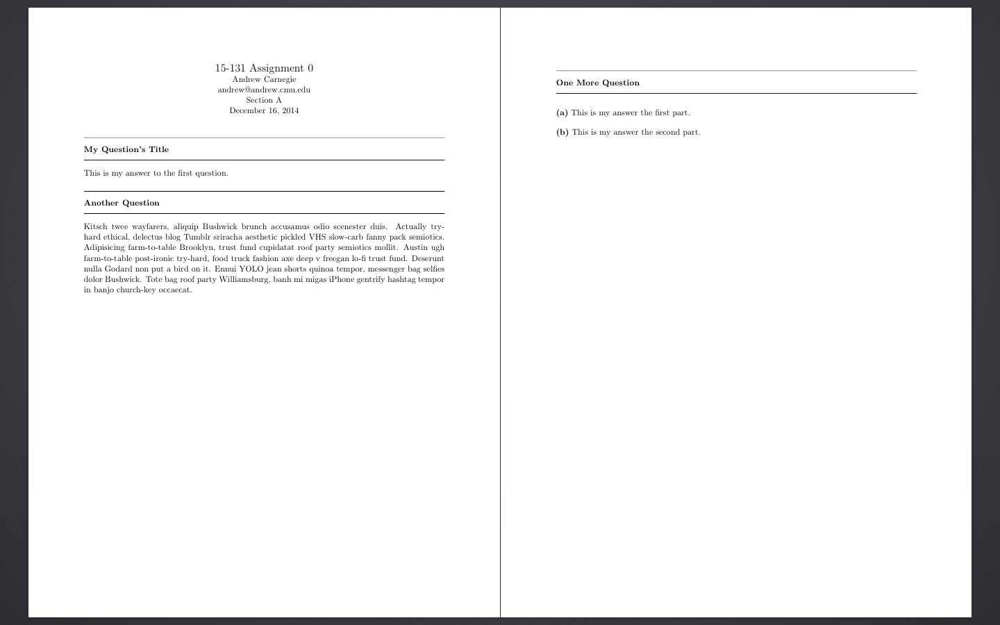

# CMU LaTeX Homework Template

## What
This is a simplistic LaTeX template for typesetting questions. It is (or a similar template) is used in a number of Computer Science classes at Carnegie Mellon University, including 15-151, 15-251, and 15-451.

## Installation
Certainly the easiest way to start using this template is to copy the .tex file to you computer and just change the fields you want.

A better way to install this template is to fork this repository and then clone that fork to a particular folder on your computer:

```
git clone https://github.com/<your-username>/cmu-latex-hw-template
```

Then, whenever you need to use the template, you can copy the template to wherever you need it. Also, if there are ever any updates, you can simply run

```
git pull
```

to update the template.

## Usage

See the [template.tex](template.tex) file for some example usage information.
The examples look like:



## License
MIT License, see [LICENSE](LICENSE).

This work is largely not my own, and unfortunately, I don't know the original author, though it is freely available online in other places. If you believe you are the owner of this document and would like it to be removed, please contact me.
